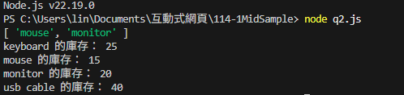
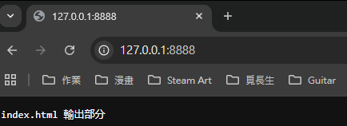
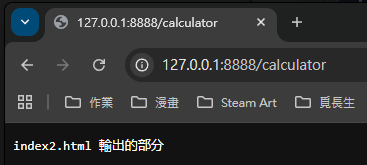
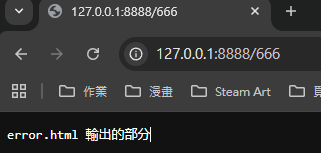

# 第2次隨堂題目-隨堂-QZ2
>
>學號：112111125   (學號和姓名都要寫)
><br />
>姓名：林劭瑋
>
1. a.

Ans:

---
<h1>1. b.獲取低庫存商品名稱</h1>
<h2>問題： 從商品陣列中篩選出庫存少於10的商品名稱</h2>
Ans:

<h3>解決方案：</h3>

```java
const products = [
  { name: "keyboard", stock: 25 },
  { name: "mouse", stock: 5 },
  { name: "monitor", stock: 8 },
  { name: "usb cable", stock: 40 }
];

function getLowStock(products) {
  return products
    .filter(product => product.stock < 10)
    .map(product => product.name);
}

console.log(getLowStock(products)); // ["mouse", "monitor"]
```
<li>使用 filter() 篩選庫存少於10的商品</li>
<li>使用 map() 提取商品名稱</li>


---
<h1>1. c.更新商品庫存</h1>
<h2>問題： 根據更新物件更新商品庫存並顯示結果</h2>
Ans:

<h3>解決方案：</h3>

```java
const products = [
  { name: "keyboard", stock: 25 },
  { name: "mouse", stock: 5 },
  { name: "monitor", stock: 8 },
  { name: "usb cable", stock: 40 }
];

function getLowStock(products) {
  return products
    .filter(product => product.stock < 10)
    .map(product => product.name);
}

console.log(getLowStock(products)); // ["mouse", "monitor"]

function updateStock(products, updates) {
  // 依照 updates 更新對應商品的庫存
  for (let product of products) {
    if (updates.hasOwnProperty(product.name)) {
      product.stock = updates[product.name];
    }
}

  // 輸出結果
  for (let product of products) {
    console.log(`${product.name} 的庫存： ${product.stock}`);
  }

  // 若要讓 console.log(updateStock(...)) 有輸出，可以回傳字串或陣列
  return products;
}

  const updates = { mouse: 15, monitor: 20 };
  updateStock(products, updates);
```
<li>使用 hasOwnProperty() 檢查是否需要更新</li>
<li>遍寫陣列進行庫存更新</li>
<li>提供詳細的庫存狀態輸姓名數量等</li>


<!--  我是分隔符號  -->
-----------------------------------------------------

<h1>2.a.Switch 路由應用</h1>
<h2>問題：</h2>
<li>在 2a.js 中使用 switch 實現路由</li>
<li>/ → 輸出 "index.html 輸出部分"</li>
<li>/calculator → 輸出 "index2.html 輸出的部分"</li>
<li>其他 → 輸出 "error.html 輸出的部分"</li>
Ans: 

<h3>解決方案：</h3>

```java
// 1、引入 http 模組
const http = require('http');

// 2、創建 http 伺服器
const server = http.createServer(function (request, response) {
  const url = request.url;  // 取得請求網址
  console.log("收到請求網址：", url);

  let answer = ''; // 回應內容

  // 使用 switch 進行路由判斷
  switch (url) {
    case '/':
      answer = 'index.html 輸出部分';
      break;
    case '/calculator':
      answer = 'index2.html 輸出的部分';
      break;
    default:
      answer = 'error.html 輸出的部分';
      break;
  }

  // 設定回應標頭避免中文亂碼
  response.setHeader('Content-Type', 'text/plain;charset=utf-8');
  // 傳送回應
  response.end(answer);
});

// 3、啟動伺服器監聽 8888 埠
server.listen(8888, function () {
  console.log("伺服器啟動成功，請訪問：http://127.0.0.1:8888");
});
```




<h1>2.b.EJS 模板渲染</h1>

<h2>問題要求:</h2>
<li>安裝 EJS: npm install ejs</li>
<li>將 HTML 檔案改為 .ejs 副檔名</li>
<li>使用 EJS 渲染對應模板</li>
<li>/ → 渲染 index.ejs</li>
<li>/calculator → 渲染 index2.ejs</li>
Ans:

<h3>解決方案：</h3>

<h3>1. 模組引入</h3>

```java
const http = require('http');    // 建立 HTTP 伺服器
const fs = require('fs');        // 讀取檔案系統
const ejs = require('ejs');      // 模板引擎
const path = require('path');    // 處理檔案路徑
```

<h3>2.靜態資源處理</h3>
<h4>功能：識別並服務 CSS、JS、圖片等靜態檔案</h4>

```java
const staticExtensions = ['.css', '.js', '.png', '.jpg', '.jpeg', '.gif', '.ico'];
const extname = path.extname(url);

if (staticExtensions.includes(extname)) {
  // 處理靜態檔案請求
}
```

<h3>MIME 類型映射：</h3>

```java
const contentTypes = {
  '.css': 'text/css',
  '.js': 'text/javascript',
  '.png': 'image/png',
  // ... 其他類型
};
```

<h3>3. 路由系統</h3>
<h4>Switch 路由邏輯：</h4>

```java
switch (url) {
  case '/':
    filePath = './index.ejs';
    cssFile = 'style.css';
    break;
  case '/calculator':
    filePath = './index2.ejs';
    cssFile = 'style2.css';
    break;
  default:
    // 404 處理
    break;
}
```

<h3>4. EJS 模板渲染</h3>
<h4>讀取和渲染過程：</h4>

```java
fs.readFile(filePath, 'utf8', (err, data) => {
  if (err) {
    // 錯誤處理
  } else {
    const html = ejs.render(data, {
      cssFile: cssFile,        // 傳遞 CSS 檔案名稱
      currentUrl: url,         // 傳遞當前 URL
      pageTitle: getPageTitle(url) // 傳遞頁面標題
    });
    response.end(html);
  }
});
```

<h3>完整程式</h3>

```java
//1、引入http模組
const http = require('http');
const fs = require('fs');
const ejs = require('ejs');
const path = require('path');

//2、創建http伺服器
const server = http.createServer(function (request, response) {
  const url = request.url;
  console.log('請求URL:', url);

  // 處理靜態檔案（CSS、JS、圖片等）
  const staticExtensions = ['.css', '.js', '.png', '.jpg', '.jpeg', '.gif', '.ico'];
  const extname = path.extname(url);
  
  if (staticExtensions.includes(extname)) {
    const filePath = '.' + url;
    
    const contentTypes = {
      '.css': 'text/css',
      '.js': 'text/javascript',
      '.png': 'image/png',
      '.jpg': 'image/jpeg',
      '.jpeg': 'image/jpeg',
      '.gif': 'image/gif',
      '.ico': 'image/x-icon'
    };

    fs.readFile(filePath, (err, data) => {
      if (err) {
        console.log('靜態檔案讀取錯誤:', filePath, err);
        response.writeHead(404);
        response.end('檔案未找到');
      } else {
        response.writeHead(200, {
          'Content-Type': contentTypes[extname] || 'text/plain'
        });
        response.end(data);
      }
    });
    return;
  }

  let filePath = '';
  let cssFile = '';

  // 使用 switch 處理路由
  switch (url) {
    case '/':
      filePath = './index.ejs';
      cssFile = 'style.css';
      break;
    case '/calculator':
      filePath = './index2.ejs';
      cssFile = 'style2.css';
      break;
    default:
      
      break;
  }

  // 讀取並渲染 EJS 頁面
  fs.readFile(filePath, 'utf8', (err, data) => {
    if (err) {
      console.log('EJS 檔案讀取錯誤:', err);
      response.writeHead(500, { 'Content-Type': 'text/plain; charset=utf-8' });
      response.end('伺服器讀取檔案錯誤');
    } else {
      try {
        const html = ejs.render(data, {
          cssFile: cssFile,
          currentUrl: url
        });
        response.writeHead(200, { 'Content-Type': 'text/html; charset=utf-8' });
        response.end(html);
      } catch (renderError) {
        console.log('EJS 渲染錯誤:', renderError);
        response.writeHead(500, { 'Content-Type': 'text/plain; charset=utf-8' });
        response.end('EJS 渲染錯誤');
      }
    }
  });
});

//3、啟動伺服器監聽8888埠
const PORT = 8888;
server.listen(PORT, function () {
  console.log(`伺服器啟動成功，訪問：http://127.0.0.1:${PORT}`);
});
```


<h1>2.c.404處理</h1>
<h2>問題</h2>
<li>將 404 錯誤處理改為渲染 index3.ejs</li>

Ans:
```r
// 在 2.b 的基礎上修改 default 分支
switch (url) {
  case '/':
    filePath = './index.ejs';
    cssFile = 'style.css';
    break;
  case '/calculator':
    filePath = './index2.ejs';
    cssFile = 'style2.css';
    break;
  default:
    filePath = './index3.ejs';
    cssFile = 'style3.css';
    break;
```
<li>在default分支中加入404頁面的檔案連結 </li>
<li>為404頁面指定專用樣式檔案 </li>
2. d.

Ans:

