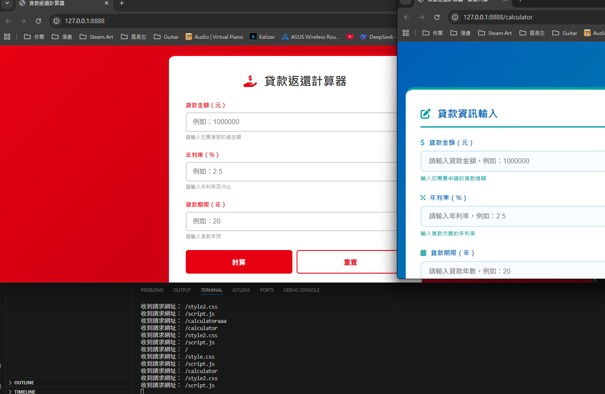
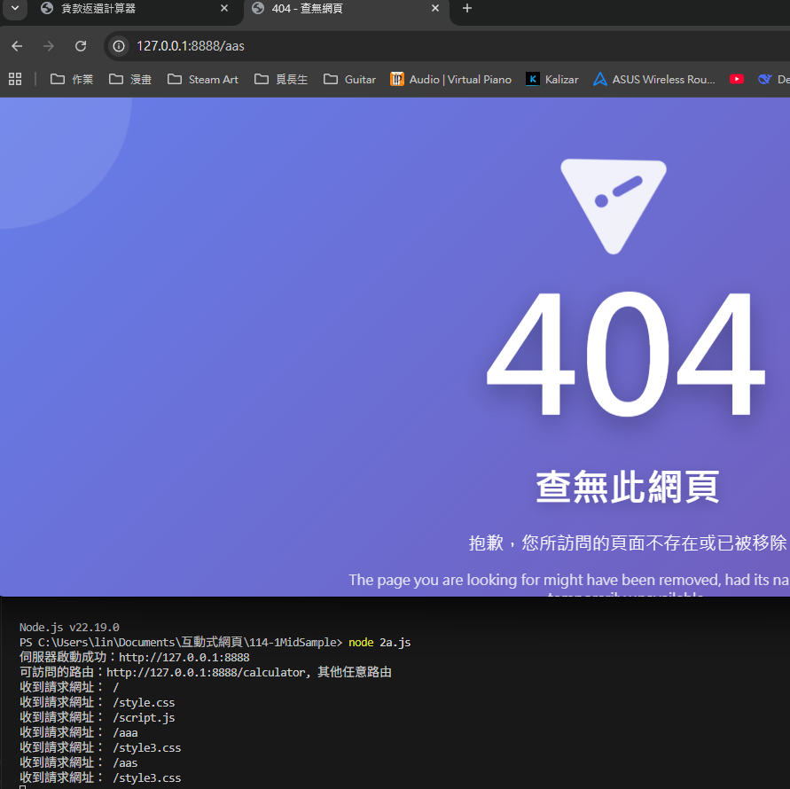

# 第2次隨堂題目-隨堂-QZ2
>
>學號：112111125   (學號和姓名都要寫)
><br />
>姓名：林劭瑋
>
1. a.

Ans:

---
<h1>1. b.獲取低庫存商品名稱</h1>
<h2>問題： 從商品陣列中篩選出庫存少於10的商品名稱</h2>
Ans:

<h3>解決方案：</h3>

```java
const products = [
  { name: "keyboard", stock: 25 },
  { name: "mouse", stock: 5 },
  { name: "monitor", stock: 8 },
  { name: "usb cable", stock: 40 }
];

function getLowStock(products) {
  return products
    .filter(product => product.stock < 10)
    .map(product => product.name);
}

console.log(getLowStock(products)); // ["mouse", "monitor"]
```
<li>使用 filter() 篩選庫存少於10的商品</li>
<li>使用 map() 提取商品名稱</li>


---
<h1>1. c.更新商品庫存</h1>
<h2>問題： 根據更新物件更新商品庫存並顯示結果</h2>
Ans:

<h3>解決方案：</h3>

```java
const products = [
  { name: "keyboard", stock: 25 },
  { name: "mouse", stock: 5 },
  { name: "monitor", stock: 8 },
  { name: "usb cable", stock: 40 }
];

function getLowStock(products) {
  return products
    .filter(product => product.stock < 10)
    .map(product => product.name);
}

console.log(getLowStock(products)); // ["mouse", "monitor"]

function updateStock(products, updates) {
  // 依照 updates 更新對應商品的庫存
  for (let product of products) {
    if (updates.hasOwnProperty(product.name)) {
      product.stock = updates[product.name];
    }
}

  // 輸出結果
  for (let product of products) {
    console.log(`${product.name} 的庫存： ${product.stock}`);
  }

  // 若要讓 console.log(updateStock(...)) 有輸出，可以回傳字串或陣列
  return products;
}

  const updates = { mouse: 15, monitor: 20 };
  updateStock(products, updates);
```
<li>使用 hasOwnProperty() 檢查是否需要更新</li>
<li>遍寫陣列進行庫存更新</li>
<li>提供詳細的庫存狀態輸姓名數量等</li>


<!--  我是分隔符號  -->
-----------------------------------------------------

<h1>2.a.Switch 路由應用</h1>
<h2>問題：</h2>
<li>在 2a.js 中使用 switch 實現路由</li>
<li>/ → 輸出 "index.html 輸出部分"</li>
<li>/calculator → 輸出 "index2.html 輸出的部分"</li>
<li>其他 → 輸出 "error.html 輸出的部分"</li>
Ans: 

<h3>解決方案：</h3>

```java
// 1、引入 http 模組
const http = require('http');

// 2、創建 http 伺服器
const server = http.createServer(function (request, response) {
  const url = request.url;  // 取得請求網址
  console.log("收到請求網址：", url);

  let answer = ''; // 回應內容

  // 使用 switch 進行路由判斷
  switch (url) {
    case '/':
      answer = 'index.html 輸出部分';
      break;
    case '/calculator':
      answer = 'index2.html 輸出的部分';
      break;
    default:
      answer = 'error.html 輸出的部分';
      break;
  }

  // 設定回應標頭避免中文亂碼
  response.setHeader('Content-Type', 'text/plain;charset=utf-8');
  // 傳送回應
  response.end(answer);
});

// 3、啟動伺服器監聽 8888 埠
server.listen(8888, function () {
  console.log("伺服器啟動成功，請訪問：http://127.0.0.1:8888");
});
```


<h1>2.b.EJS 模板渲染</h1>

<h2>問題要求:</h2>
<li>安裝 EJS: npm install ejs</li>
<li>將 HTML 檔案改為 .ejs 副檔名</li>
<li>使用 EJS 渲染對應模板</li>
<li>/ → 渲染 index.ejs</li>
<li>/calculator → 渲染 index2.ejs</li>
Ans:

<h3>解決方案：</h3>

<h3>完整程式</h3>

```java
// 1. 引入模組
const http = require('http');
const fs = require('fs');
const ejs = require('ejs');
const path = require('path');

// 2. 創建 http 伺服器
http.createServer((req, res) => {
  const url = req.url;
  const ext = path.extname(url); // 取得請求網址的副檔名，用於判斷檔案類型
  console.log("收到請求網址：", url);

  // MIME 類型定義 - 建立副檔名與 Content-Type 的對應關係
  const mime = {
    '.css': 'text/css',
    '.js': 'text/javascript', 
    '.png': 'image/png',
    '.jpg': 'image/jpeg',
    '.jpeg': 'image/jpeg',
    '.gif': 'image/gif',
    '.ico': 'image/x-icon'
  };

  // 處理靜態檔案（CSS、JS、圖片等）
  if (mime[ext]) {
    fs.readFile('.' + url, (err, data) => {
      if (err) {
        res.writeHead(404);
        return res.end('檔案未找到');
      }
      // 設定正確的 Content-Type 讓瀏覽器能正確解析檔案
      res.writeHead(200, { 'Content-Type': mime[ext] });
      return res.end(data);
    });
    return; // 靜態檔案處理完成，結束此請求
  }

  // 使用 switch 處理不同路由
  let filePath = '';  // EJS 模板檔案路徑
  let cssFile = '';   // 對應的 CSS 檔案名稱

  switch (url) {
    case '/':
      filePath = './index.ejs';
      cssFile = 'style.css';
      break;
    case '/calculator':
      filePath = './index2.ejs';
      cssFile = 'style2.css';
      break;
    default:
      answer = 'error.html 輸出的部分';
      break;
  }
  // 讀取 EJS 模板並渲染成 HTML
  fs.readFile(filePath, 'utf8', (err, data) => {
    // 若讀取模板檔案失敗，回傳 500 伺服器錯誤
    if (err) {
      res.writeHead(500, { 'Content-Type': 'text/plain; charset=utf-8' });
      return res.end('伺服器讀取檔案錯誤');
    }
    
    try {
      // 使用 EJS 渲染模板，傳入動態資料（CSS 檔案名稱和當前網址）
      const html = ejs.render(data, { cssFile, currentUrl: url });
      // 設定回應標頭，告訴瀏覽器這是 UTF-8 編碼的 HTML 內容
      res.writeHead(200, { 'Content-Type': 'text/html; charset=utf-8' });
      res.end(html);
    } catch (ejsErr) {
      // 如果 EJS 渲染過程發生錯誤，回傳 500 錯誤
      res.writeHead(500, { 'Content-Type': 'text/plain; charset=utf-8' });
      res.end('EJS 渲染錯誤');
    }
  });
}).listen(8888, () => {
  console.log('伺服器啟動成功：http://127.0.0.1:8888');
  console.log('可訪問的路由：http://127.0.0.1:8888/calculator, 其他任意路由');
});
```



<h1>2.c.404處理</h1>
<h2>問題</h2>
<li>將 404 錯誤處理改為渲染 index3.ejs</li>

Ans:
``` java
// 在 2.b 的基礎上修改 default 分支
switch (url) {
    case '/':
      filePath = './index.ejs';
      cssFile = 'style.css';
      break;
    case '/calculator':
      filePath = './index2.ejs';
      cssFile = 'style2.css';
      break;
    default:
      filePath = './index3.ejs';
      cssFile = 'style3.css';
      break;
  }
```
<li>在default分支中加入404頁面的檔案連結 </li>
<li>為404頁面指定專用樣式檔案 </li>


2. d.

Ans:

